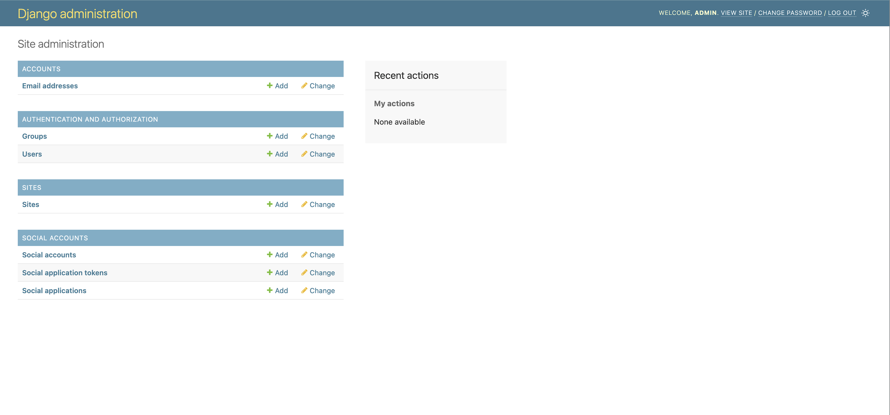
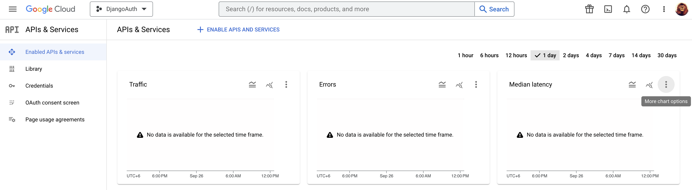
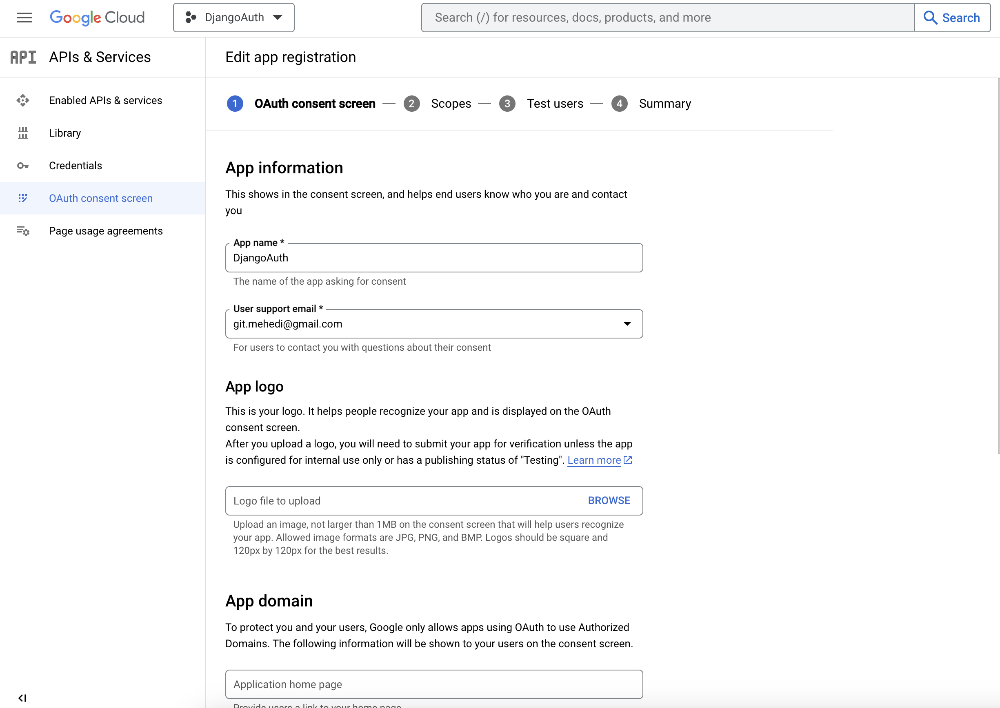
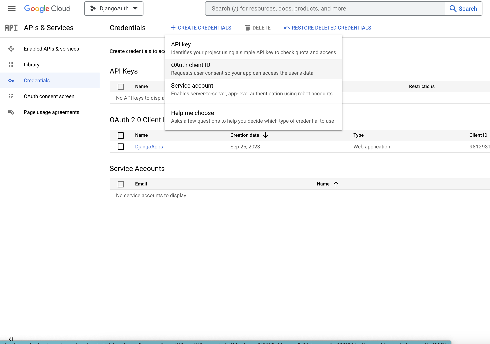
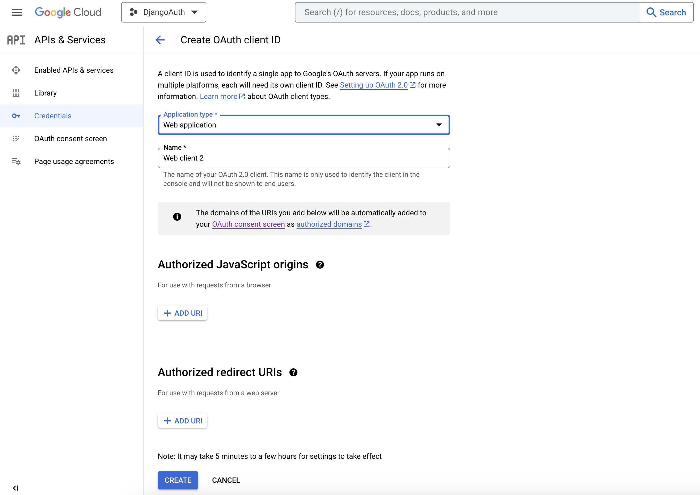
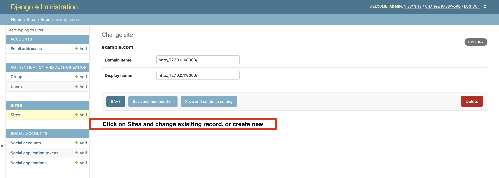
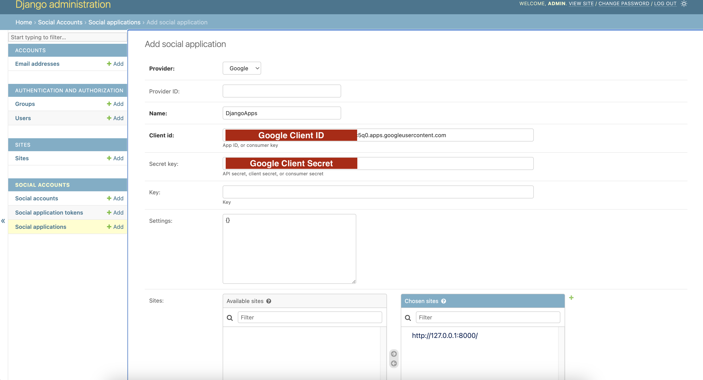
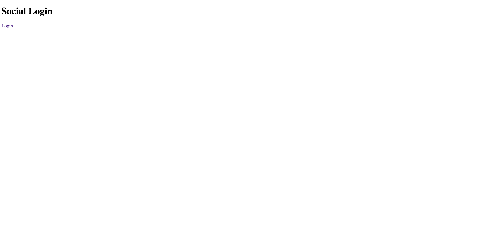
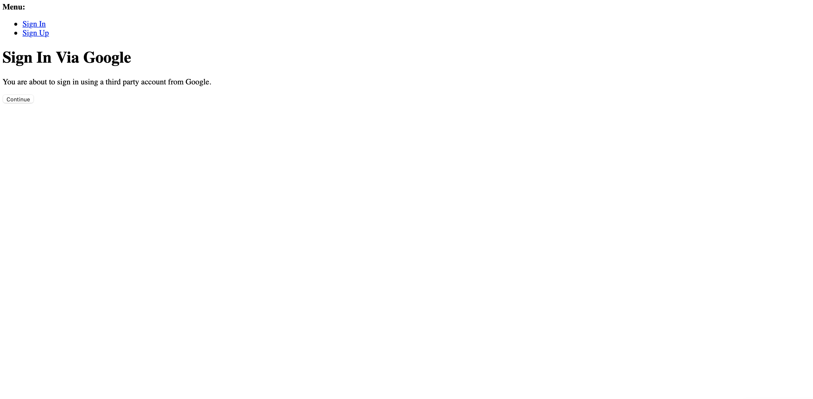
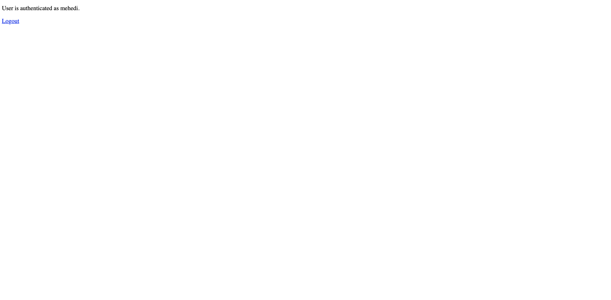

# Django Social Authentication (Gaogle,Github,Facebook,Twitter)

## Prerequisites

- Django
- Django-allauth
- Social Account Credentials (Gaogle,Github,Facebook,Twitter)

# Project Structure

## Create a new directory and project structure

```bash
$ mkdir googleauth
$ cd googleauth
```

## Create new virtual environment for the project

```bash
$ python -m venv socialenv
$ source socialenv/bin/activate
```

## Install python packages for the projects

```bash
$ pip install django==4.20.0 django-allauth==0.57.0
```

## Create project for social authentication

```bash
$ django-admin startproject sociallogin
$ cd sociallogin
```

## Create new apps for sociallogin project

```bash
$ python manage.py startapp users_login
```

## Configure newly apps `users_login` in `sociallogin` project. Open `settings.py` from sociallogin projects and configure below.

```python
# Add settings.py inside sociallogin/socialallogin

INSTALLED_APPS = [
    'django.contrib.admin',
    'django.contrib.auth',
    'django.contrib.contenttypes',
    'django.contrib.sessions',
    'django.contrib.messages',
    'django.contrib.staticfiles',
    'users_login', # Users Login apps which was created
]
```

## Add all `django-allauth` apps in `sociallogin` in settings.py file

```python
INSTALLED_APPS = [
    ...
    'users_login', 
    'django.contrib.sites', # apps for social sites configuration
    'allauth', # apps for all authentication
    'allauth.account', # # apps for account auth
    'allauth.socialaccount', # apps for socialaccount
]
```

## Add `django-allauth` middleware in `sociallogin` in settings.py file

```python
MIDDLEWARE = [
    'django.middleware.security.SecurityMiddleware',
    'django.contrib.sessions.middleware.SessionMiddleware',
    'django.middleware.common.CommonMiddleware',
    'django.middleware.csrf.CsrfViewMiddleware',
    'django.contrib.auth.middleware.AuthenticationMiddleware',
    'django.contrib.messages.middleware.MessageMiddleware',
    'django.middleware.clickjacking.XFrameOptionsMiddleware',
    'allauth.account.middleware.AccountMiddleware', # middleware for django-allauth
]  
```
## Add following variables in `settings.py` file for various uses for auth integration 
```python
# Used for django.contrib.sites configuration
SITE_ID = 1

```
## Migrate database structure in projects and create superuser

```bash
$ python manage.py migrate
$ python manage.py createsuperuser --username=admin --email=admin@gmail.com
```

## Start the application

```bash
$ python manage.py runserver
```

## Login application using `http://127.0.0.1:8000/admin/` and it will show following output



# Configure Google Authentication for Django

## Prerequisites
- Create Google API for Application
- Configure Google API with Django Application

## Create Google API

You'll need to set up an OAuth application via [Google Developers Console](https://console.cloud.google.com/) to add a Google login to your app. We start by creating a new project:








Download Google Client ID and Client Secret from download option

## Configure Google API with Django Application

### Add following configuration in Django `settings.py` file

```python
# Add google provider apps in django settings.py
INSTALLED_APPS = [
    ...
    'allauth.socialaccount.providers.google', # add providers for google api
]

# Add following changees on settings.py
AUTHENTICATION_BACKENDS = [
    # Default backend for Django authentication.
    'django.contrib.auth.backends.ModelBackend',
    # Allauth specific authentication methods, such as login by e-mail.
    'allauth.account.auth_backends.AuthenticationBackend',
]

# LOGIN_REDIRECT_URL, destination of login page in your urls.py
LOGIN_REDIRECT_URL = '/'
# LOGOUT_REDIRECT, where to redirect when user logout
LOGOUT_REDIRECT_URL = '/'

# providers which will use as provider in template
SOCIALACCOUNT_PROVIDERS = {
    'google': {
        'SCOPE': ['profile', 'email'],
        'AUTH_PARAMS': {'access_type': 'online'},
    }
}
```

### Configure Google Client ID and Client Secret in Django Dashboard

#### Add sites information in django-dashboard


#### Configure Client ID and Client Secret in Django Dashboard



### Add code in several files

#### Create new `urls.py` file and include with sociallogin `urls.py` file
```python
# Create new urls.py in sociallogin/users_login/urls.py

from django.urls import path
from . import views

urlpatterns = [
    path('', views.home, name='home'),
    path('logout/', views.logout_view, name='logout_view'),
]

# Add urls.py in sociallogin/sociallogin/urls.py
from django.contrib import admin
from django.urls import path, include

urlpatterns = [
    path('admin/', admin.site.urls),
    path('account/', include('allauth.urls')), # Add this line
    path('', include('users_login.urls')), # Add this line 
]
```

#### Add functionality for `home` and `logout_view` views.
```python
# Add in views.py 

from django.shortcuts import render, redirect
from django.contrib.auth import logout


def home(request):
    return render(request, 'home.html')


def logout_view(request):
    logout(request)
    return redirect('/')
```

#### Add templates for `home` and `logout_view` views. Create a `home.html` in sociallogin/users_login/templates/home.html

```html
<!DOCTYPE html>
<html lang="en">
<head>
    <meta charset="UTF-8">
    <title>Social Login</title>
</head>
<body>


    <p>User is authenticated as {{ user.username }}.</p>
    <a href="logout/">Logout</a>

    <h1>Social Login</h1>
    <a href="?next=/">Login</a>

</body>
</html>
```
Finally Run the Application
```python
$ python manage.py runserver
```





# References
- https://blog.devgenius.io/implement-login-functionality-using-google-in-django-ee2a0fba2861
- https://pylessons.com/django-google-oauth
- https://www.youtube.com/watch?v=yO6PP0vEOMc


